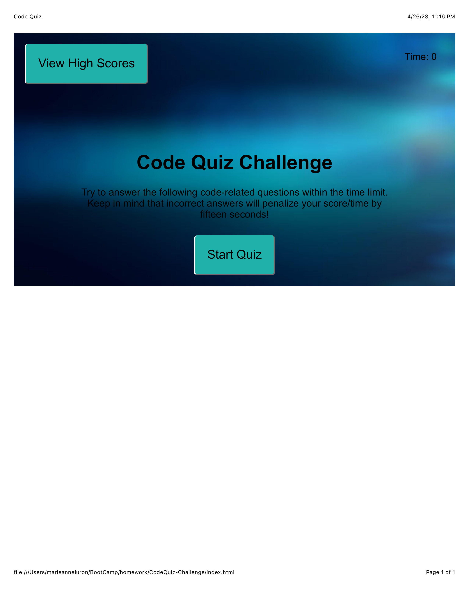

# CodeQuiz-Challenge
Web APIs: Code Quiz

## The Challenge
This typical coding assessment includes both multiple-choice questions and interactive coding challenges. To help familiarize you with these tests and allow you to use the skills covered in the Web APIs Module, you are invited to build a timed Code Quiz with multiple-choice questions. This app will run in the browser and will feature dynamically updated HTML and CSS powered by JavaScript code that you write. It will have a clean, polished, and responsive user interface.

## Acceptance Criteria
GIVEN I am taking a code quiz
WHEN I click the start button
THEN a timer starts and I am presented with a question
WHEN I answer a question
THEN I am presented with another question
WHEN I answer a question incorrectly
THEN time is subtracted from the clock
WHEN all questions are answered or the timer reaches 0
THEN the game is over
WHEN the game is over
THEN I can save my initials and my score

## Usage & Link
-
- Created two HTML files (one to take quiz and one to view scores)
- Added CSS elements to make the quiz's theme blue background
- Created two JavaScript files (one containing functions to execute the quiz and one to store previous scores)

## Screenshots
-

## Contact me
- [GitHub](https://github.com/mluron-ArxFjs)

- mluron2@gmail.com
